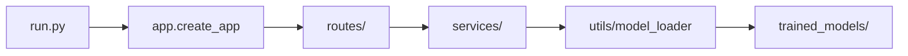

# AgriSense — Indian Smart Agriculture Platform

Production-style Flask application for **Indian multi-crop disease detection** (two-stage EfficientNet pipeline, real-world augmentation, non-crop rejection) and **crop recommendation** (Random Forest on soil and climate features).

### Supported Indian crops (24+)

Rice, Wheat, Maize, Cotton, Sugarcane, Tomato, Potato, Onion, Chilli, Brinjal, Groundnut, Soybean, Mango, Banana, Grapes, Apple, Pomegranate, Coconut, Turmeric, Ginger, Pulses, Millets, Mustard, Sunflower

### Two-stage AI pipeline

| Stage | Model | Task |
|-------|--------|------|
| **1** | `crop_classifier.h5` | Crop type + reject invalid images (faces, objects, backgrounds) |
| **2** | `disease_classifier.h5` | Disease for predicted crop (crop-conditioned EfficientNet) |

## Project structure

```
capstone-project-crop-recommendation/
├── app/                          # Flask application package
│   ├── __init__.py               # App factory (create_app)
│   ├── routes/                   # HTTP blueprints (thin controllers)
│   │   ├── disease.py            # GET /, POST /predict
│   │   └── recommendation.py     # /api/recommendation/*
│   ├── data/                     # Disease solutions & supported crops JSON
│   ├── services/                 # Business logic & ML inference
│   │   ├── disease_detection.py
│   │   ├── disease_solutions.py
│   │   └── crop_recommendation.py
│   ├── models/                   # Shared constants / schemas
│   ├── utils/                    # Leaf detection, severity, image pipeline
│   ├── templates/                # Jinja2 HTML
│   └── static/                   # CSS, JS (app.js)
├── datasets/                     # Training & reference data
│   ├── Crop_recommendationV2.csv
│   └── PlantVillage/             # Image dataset (for training only)
├── trained_models/               # Saved model artifacts (do not delete)
│   ├── crop_disease_model.h5
│   ├── npk_rf_pipeline.pkl
│   └── crop_options.pkl
├── scripts/                      # Training, EDA, evaluation CLIs
├── notebooks/                    # Jupyter experiments
├── tests/                        # Automated tests
├── config.py                     # Paths and settings
├── run.py                        # Dev server entry point
├── requirements.txt
└── README.md
```

### What each folder does

| Folder | Purpose |
|--------|---------|
| `app/routes/` | HTTP layer only — parse requests, call services, return JSON/HTML |
| `app/services/` | Prediction logic; no Flask imports |
| `app/utils/` | Reusable helpers (model cache, image pipeline) |
| `app/models/` | Shared ML/API constants |
| `app/templates/` & `app/static/` | Web UI for disease detection |
| `datasets/` | CSV + PlantVillage images used by **training** scripts |
| `trained_models/` | Deployed `.h5` / `.pkl` weights (loaded at runtime) |
| `scripts/` | Offline training and evaluation (not used by the web server) |
| `notebooks/` | Exploratory analysis |
| `tests/` | Smoke and integration tests |

## Quick start

### 1. Prerequisites

- Python 3.9+
- Webcam (optional, for the disease detection UI)

### 2. Install

```bash
cd capstone-project-crop-recommendation
python3 -m venv venv
source venv/bin/activate          # Windows: venv\Scripts\activate
pip install -r requirements.txt
```

### 3. Data & models

Ensure these exist:

```
datasets/Crop_recommendationV2.csv
datasets/PlantVillage/              # Required only to retrain the CNN
trained_models/crop_disease_model.h5
trained_models/npk_rf_pipeline.pkl
trained_models/crop_options.pkl
```

**PlantVillage:** place the [PlantVillage dataset](https://github.com/spMohanty/PlantVillage-Dataset) under `datasets/PlantVillage/` if you need to retrain the disease model. Inference works with the existing `.h5` file only.

### 4. Run

```bash
python run.py
```

Open **http://localhost:5000** for the AgriSense disease detection UI (camera capture, image upload, severity analysis, and treatment recommendations).

Production (example):

```bash
FLASK_ENV=production SECRET_KEY='your-secret' gunicorn -w 2 -b 0.0.0.0:5000 "run:app"
```

> On macOS, the dev server disables Flask’s auto-reloader to avoid TensorFlow fork crashes.

## API

### Disease detection

`POST /predict`

```json
{ "image": "data:image/png;base64,..." }
```

**Pipeline:** image quality check → OpenCV leaf detection → CNN classification → confidence threshold (70%) → crop support check → disease solutions & severity.

**Success response (example):**

```json
{
  "status": "success",
  "crop": "Tomato",
  "disease": "Late Blight",
  "confidence": 94.2,
  "severity_percent": 85,
  "harmfulness": "High",
  "impact": "This disease can reduce crop yield significantly if untreated.",
  "solution": { "cause": "...", "symptoms": [], "pesticides": [], "prevention": [] }
}
```

**Error types:** `invalid_image`, `no_leaf`, `low_confidence`, `unsupported_crop`

### Crop recommendation

| Method | Endpoint | Description |
|--------|----------|-------------|
| GET | `/api/recommendation/available-crops` | List supported crops |
| POST | `/api/recommendation/recommend-crop` | Predict best crop from env (+ optional N,P,K) |
| POST | `/api/recommendation/predict-npk` | Typical N/P/K for a crop from reference data |

Example:

```bash
curl -X POST http://localhost:5000/api/recommendation/recommend-crop \
  -H "Content-Type: application/json" \
  -d '{"temperature": 24.5, "humidity": 80, "ph": 6.5, "rainfall": 220}'
```

## Training (offline) — Indian agriculture

```bash
# 0. Generate invalid-object images (bottles, phones, room photos, etc.)
python scripts/generate_invalid_object_images.py --per-category 100

# 1. Add datasets under datasets/sources/ (see datasets/sources/README.md)
# 2. Build merged dataset + train both stages:
python scripts/train_indian_agriculture_pipeline.py

# Generate treatment DB for all model classes:
python scripts/generate_model_crop_solutions.py

# Or step-by-step:
python scripts/prepare_indian_agriculture_dataset.py
python scripts/train_stage1_crop_classifier.py
python scripts/train_stage2_disease_classifier.py
```

Legacy single-model training (tomato-only fallback):

```bash
python scripts/train_disease_detection.py
```

Other scripts:

```bash
python scripts/train_crop_recommendation.py  # Random Forest — needs CSV
python scripts/eda.py                        # Exploratory plots
python scripts/evaluate_model.py             # Metrics
python scripts/test_predictions.py           # Quick inference check
```

## Configuration

Edit `config.py` or set environment variables (copy `.env.example` to `.env`):

| Variable | Default | Description |
|----------|---------|-------------|
| `FLASK_ENV` | `development` | `development` \| `production` \| `testing` |
| `SECRET_KEY` | dev placeholder | **Required** in production |
| `OPENAI_API_KEY` | — | Enables LLM treatment plans & smart chatbot |
| `OPENWEATHER_API_KEY` | — | Enables live weather in the Weather tab |
| `ENABLE_TTA` | `true` | Test-time augmentation for better inference accuracy |

## New features (v2)

| Feature | How it works |
|---------|----------------|
| **Many crops** | Crops tab lists all model-trained species; add dataset folders + retrain to expand |
| **Better accuracy** | TTA at inference; retrain with `--architecture efficientnetb0 --epochs 25` + fine-tuning |
| **Explain predictions** | Top-3 matches + reasoning steps after each scan |
| **LLM treatment** | "Get AI Treatment Plan" button (needs `OPENAI_API_KEY`; falls back to JSON database) |
| **Weather** | Weather tab — GPS or city lookup with farming tips |
| **Farmer chatbot** | Chat tab — rule-based offline or LLM when API key is set |
| **Mobile UI** | Bottom navigation, safe-area padding, 48px touch targets |
| **Cloud deploy** | `Dockerfile`, `docker-compose.yml`, `render.yaml` |

### Docker

```bash
cp .env.example .env   # add API keys optional
docker compose up --build
# → http://localhost:5001
```

### Retrain for more crops / higher accuracy

```bash
python scripts/train_disease_detection.py \
  --architecture efficientnetb0 \
  --epochs 25 \
  --fine-tune-epochs 10 \
  --dataset datasets/sources/dataset
```

## Tests

```bash
pytest tests/ -v
```

## Architecture



**Separation of concerns:** routes handle HTTP; services run ML; `scripts/` train models; `utils/model_loader` caches artifacts with thread-safe lazy TensorFlow import.

## License

Capstone project — educational use.
